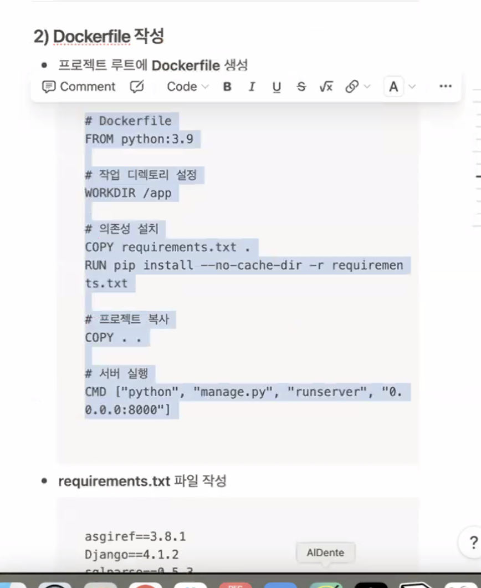

- `if`: 조건이 참일 경우에만 코드 블록을 실행
- `elif`: 앞선 `if` 혹은 다른 `elif` 조건이 거짓일 때, 새로운 조건을 검사
- `else`: 위의 모든 조건이 거짓일 때 실행되는 코드 블록

- `and`: 모든 조건이 True일 때만 True
- `or`: 하나라도 조건이 True이면 True
- `not`: 조건의 결과를 반전(True ↔ False)

 조건문과 함께 자주 쓰이는 비교 연산자

 

 